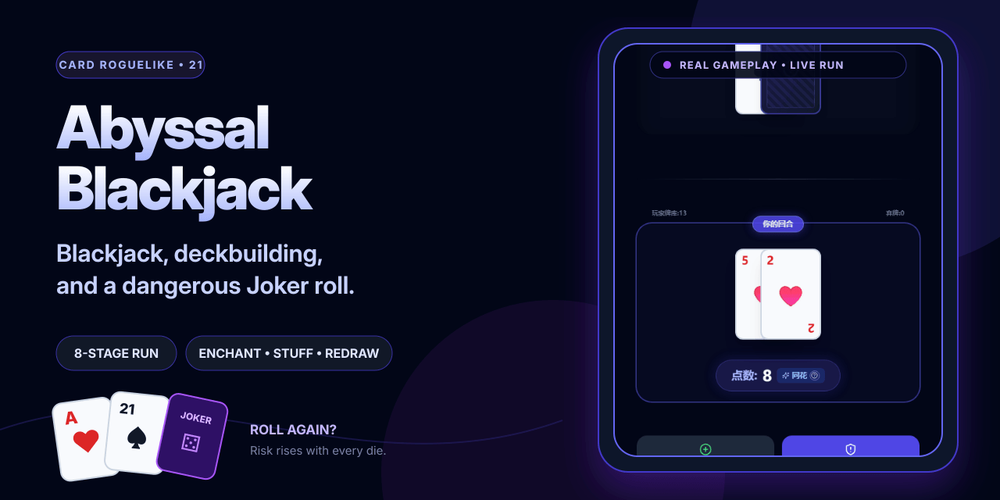

# AbyssalBlackjack

[English](README.md)

以 21 点为核心的单人肉鸽卡牌游戏，包含塞牌、重抽、小丑牌和附魔构筑。



**[在线体验](https://game.onovich.com/AbyssalBlackjack/)**

## 项目包含什么

- 以 21 点为基础的牌组构筑。
- 小丑牌、附魔与重抽决策。
- 包含自动检查的浏览器版本。

## 快速开始

安装依赖并启动本地版本：

```bash
npm install
npm run dev
```

仓库还提供 `npm run build`、`npm run test`。

## 仓库结构

- `src/` — 应用与库的源代码。
- `docs/` — 项目文档与设计说明。
- `origin/` — 原始原型与设计资料。
- `.github` — 自动化与 GitHub Pages 工作流。
- `index.html` — Web 入口。

## 文档

- [`origin/design.md`](origin/design.md)
- [`docs/lessons-learned.md`](docs/lessons-learned.md)
- [`docs/manual-regression-checklist.md`](docs/manual-regression-checklist.md)
- [`docs/next-steps.md`](docs/next-steps.md)
- [`docs/TODO.md`](docs/TODO.md)

## 当前状态

仓库已经包含与上述用途对应的实现和项目材料。仓库内包含自动化测试；具体兼容性仍取决于目标运行时、编辑器或平台。

## 许可证

当前仓库未包含开源许可证。
